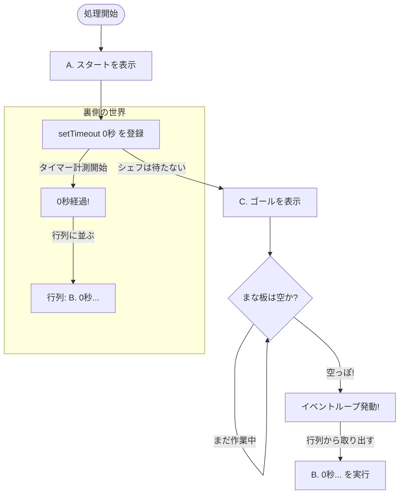

- 同期
  - 前の処理が終わるまで待つ → 順番待ち → 遅い
- 非同期

  - 自分だけ勝手に別の動きをする
  - 待たなくていい（速い）

- ノンブロッキングとは？
  - 非同期処理

## JS の基本

- シングルスレッド
  - ワンオペのお店的なもの
  - 同期処理
  - Web Workers というのを使うと，別店舗で複数コアを使用可能
- マルチスレッド

  - 並列処理
  - 巨大な厨房
    - メモリ（冷蔵庫）も共有だから競合が起きる
    - （プリン争奪戦）

- 非同期処理

  - 裏方で作業

- ０秒後っていうのは『今すぐ』っていう意味じゃない

  - 何もやることがなければ、すぐ ⭐️

## 勉強のコツ

- 図解大切

## [[イベントループ]]ででてくる用語まとめ

- まな板 → 「[[コールスタック]]」とも呼ばれる
  - コールスタックは一つしか乗らない
- 行列 → 「[[タスクキュー]]」とも呼ばれる
- 全体の仕組み → 「イベントループ」と呼ばれる

- タスクキューの並び順について
  - 待ち時間が短い順に「行列」に並ぶ
    - 0 秒の正体 →「0 秒後に実行」ではなく「0 秒後に行列に並ぶ」



## [[Promise]]の状態の用語

- Pending（ペンディング）
  - 準備中
- Fulfilled（フルフィルド）
  - 成功！
  - データが到着したこと（処理が完了したこと）を解決（Resolve）と言うよ
- Rejected（リジェクテッド）
  - 失敗

この状態を変化させる事ができるのは JS ではなく，ブラウザとか Web API とはが書き換えるよ ♪
ちなみに，JS は待つだけ

[[コールバック]]関数とは？
引数として他の関数に渡され、外側の関数の中で呼び出されて、何らかのルーチンやアクションを完了させる関数

- Promise とは？
  - 予約チケットのこと
  - 約束のオブジェクト
  - 非同期処理の最終的な完了もしくは失敗を表すオブジェクト

# 2025-12-21

- 6.1 チケットを「窓口」に出そうまでやったよ

# 2025-12-21

## Promise の.then について(成功したとき)

- 「リジェクトを返す」か「例外を投げる」以外は成功で次に渡る

## 失敗した時の窓口 ～.catch()～

以下のコードを実行したときに，`Promise {<fulfilled>: undefined}`が undefined になるのはどうして？
`Promise.resolve(100)`だけやったら`Promise {<fulfilled>: 100}`になる

```js
Promise.resolve(100)
  .then((num) => {
    console.log("1. 受け取った:", num);
    return num * 2; // ← return がない！
  })
  .then((num) => {
    console.log("2. 受け取った:", num); // 何が出る？
  });
```

.catch は最後に一個書くだけで途中失敗しても拾ってくれる
→ 途中の処理に合わせてエラーを変える事はできるの？

タスクキューに並んでいる setTimeout よりマイクロタスクに並んでいる Promise の方が先に実行される（割り込む）

async function は「中身を Promise で包んで返す」自動包装機。
new Promise とかをやる必要がない！関数を定義する前に async を書くだけで `main().catch(...)` や `await main()` が使える！

- 非同期処理が始まるタイミングは？
  - 非同期の仕事は orderCoffee() 内の new Promise → setTimeout で始まっている
  - その結果をどう扱うかを .then/.catch で指定している、という関係です。

# 2025-12-22

async 関数を呼んだら、
中身がほしいなら await するか .then() を使おう！

```js
// 各種ダミー関数
const download = () =>
  new Promise((resolve) =>
    setTimeout(() => resolve("ダウンロードデータ"), 1000)
  );
const process = (data) =>
  new Promise((resolve) => setTimeout(() => resolve(data + "を加工"), 1000));
const display = (data) =>
  new Promise((resolve) => {
    console.log("画面に表示:", data);
    resolve();
  });

// エラー実験用の「爆発する関数」
const dangerousWork = () => Promise.reject("爆発しました💥");
```

```js
download((data) => {
  process(data, (processed) => {
    display(processed, () => {
      console.log("完了！");
    });
  });
});
```

```js
download()
  .then((data) => process(data))
  .then((processed) => display(processed))
  .then(() => console.log("完了！"));
```

```js
// 魔法を使うための関数を定義
async function main() {
  console.log("🚀 スタート！");

  // awaitをつけるだけで、完了するまでここでピタッと止まってくれる！
  const data = await download();
  console.log("1. ダウンロード完了！");

  const processed = await process(data);
  console.log("2. 加工完了！");

  await display(processed);
  console.log("3. 表示完了！");

  console.log("🎉 すべて完了！");
}

// 実行！
main();
```

- 3 つの掟（復習）

  - await は async function の中でしか使えない！
  - async function は必ず Promise を返す！ → だから .catch() がつけられる
  - Promise を放置しない！ → await か .catch() で必ず受け止める

- フローチャートは大事！！

- try...catch が捕まえるエラーは？

  - プログラムのミス
  - Promise の失敗（Reject）

- ローディング画面を消す時（isLoading = false）
- 連打防止で無効化したボタンを、また押せるように戻す時（button.disabled = false）
- 開いたファイルやカメラを閉じる時（後始末）

「成功しても失敗しても、最後は元の状態に戻したい！」という時は finally の出番です。

- throw を忘れかけている！

- 並行
  - 複数のタスクを切り替えながら一人がこなすイメージ
- 並列
  - パラレルワールドと同じ理解。複数で同時に進める

# 2025-12-23

ここからスタート 👇️
Step 1：まずは普通の書き方で理解しよう
https://github.com/komiyamma/site_ichika_study_async_await_fetch/blob/main/D09.md

- 並列化の恩恵を受けられるときは？

  - ブラウザとかに仕事を任せているとき
  - Promise.all は「魔法の並列化」ってわけではないよ

- Promise.all の引数は一つの配列のみ。

```js
const [userObj, sweetsArray] = await Promise.all([getUser(), getSweets()]);
```

- fetch と response.json() は必ずセットで書く！」

  - 「伝票を確認する（1 回目）」→「荷物を受け取って開ける（2 回目）」という 2 段構えが基本セット

- json() でエラーになったら、text() に変えて中身を確認してみる

- React やるなら分割代入はしっかりやる

# 2025-12-24

- [[fetch]] を勉強する
- ここからスタート 👇️
- コラム：失敗しても自分のせいにしないで！

  - https://github.com/komiyamma/site_ichika_study_async_await_fetch/blob/main/D10.md

- 検討
- Blob で画像を取る方法を模索してみる

```js
const data = await response.blob(), then const img_url = URL.createObjectURL(data) , then you can send img_url as url in 
```

```js
​​const response = await fetch(imageUrl); const blob = await response.blob(); const blobUrl = URL.createObjectURL(blob);
```

[[AI]] で教材を作る方法
イチカドンパラメタを入れた Gemini 3 Pro が中核で、Codex 5.2 と Claude Opus のレビュー（イチカドンパラメタの人がこれを学習したらどうなりますか？ という評価）
これを S+になるまで反復する。

---

# 2025-12-24

- fetch は時間がかかるので、必ず「ローディング表示」をする。

- データを get するとき
  - JSON 文字列をもらってきて、オブジェクトに直す処理
- ## データを送るとき

- json()
  - 入力として JSON を取って解釈
  - JavaScript のオブジェクトを生成します。

```js
// myOderは、JSON文字列にして送信する
const myOder = {
  food: "sweetPotato🍠",
  cake: "いちごのタルト🍓",
  drink: "cafe latte",
};

async function postData() {
  console.log("・・・データ送る準備中・・・");
  //   responseはJSON文字列
  const response = await fetch("https://example.com/api/order", {
    method: "post",
    header: { "Content-type": "application/json" },
    body: JSON.stringify(myOder),
  });
  console.log(response);
  //   json()によって、responseはJavasrcitptのオブジェクトに変換される
  const result = await response.json();
  console.log(result);
  console.log("✅ 注文完了！ ID:", result.id);
}
```

- 使い分けの指針
  - 「文字列を持っているなら JSON.parse」
  - 「fetch のレスポンスなら response.json()」
    - response.json() は JSON.parse を自動でやってくれるショートカット
    - fetch 専用の便利メソッド

```js
// 🔧 もし response.json() がなかったら、こう書く必要があった
const text = await response.text(); // まずテキストで受け取る
const data = JSON.parse(text); // 手動で変換

// ✨ でも response.json() があるから、これ1行でOK！
const data = await response.json(); // テキスト受け取り + 変換を自動でやる
```

- 変数名を複数形にしたら、文字列の配列にしたほうがいい

# 2025-12-25

## 想定外の対処法を学ぶ

- 堅牢なアプリになる
- ステータスコードの確認方法は？

  - 201 Created はどこにあるの？

- async と await は一緒に使う
- 非同期処理と同期処理の違い

  - 同期処理
    - 前の処理が終わるまで次に進まない
  - 非同期処理
    - 待っている間に他の処理を進められる

- 非同期処理で`throw new Error()`をしたらエラーがキャッチされたら Promise チケットは`reject`になる

- 成功（try）: サーバーから返事があった
  - （200 OK も、404 Not Found も、500 Error も含む）。
  - 404 でも成功にあるから、ここは自分の目で確かめる
- 失敗（catch）
  - サーバーに繋がらない（Wi-Fi 切れ、URL のドメイン間違いなど）。
